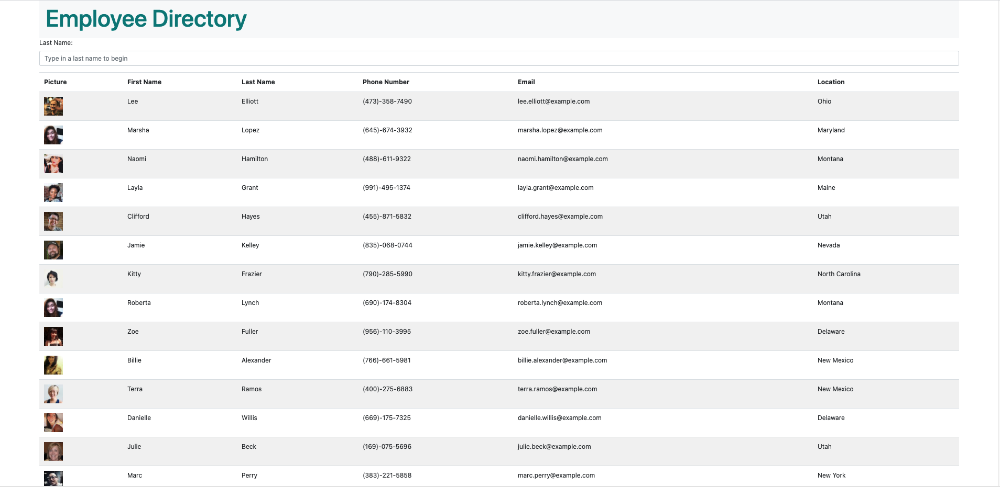

# react-employee-directory
An Employee Directory created with React. One can view their employee directory all at once. An employee or manager would benefit greatly from being able to view non-sensitive data about other employees. It would be particularly helpful to be able to filter employees by name.


<br>

DEPLOYED: [HERE ON HEROKU](https://polar-citadel-98159.herokuapp.com/)
<br>
<br>

## Built With

* [Javascript](https://www.w3schools.com/)
* [React](https://www.w3schools.com/)
* [Node](https://nodejs.org/)
* [Axios](https://www.w3schools.com/)
* [Bootstrap](https://getbootstrap.com/)

## Getting Started
To get a local copy up and running follow these simple steps. You can also download the source files provided. You will need a text editor such as Visual Studio Code, Xcode or similar to edit the source code.

## Installation
1. Clone the repo
   ```sh
   git clone https://github.com/justpeachy8688/react-employee-directory
   ```

2. Pull the latest
   ```sh
   git pull

## Contact

Taylor Sanders<br>
https://github.com/justpeachy8688
